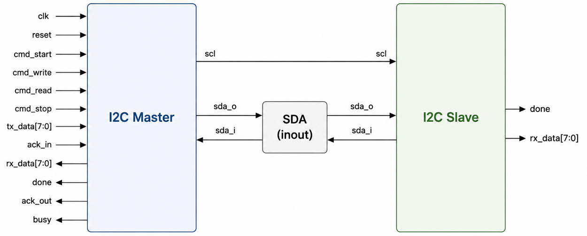

# I2C & SPI RTL Design

Verilog/SystemVerilog를 사용하여 I2C 및 SPI 프로토콜을 RTL로 설계하고,  
Testbench, UVM 및 FPGA를 활용하여 RTL 동작을 검증한 프로젝트입니다.

---

## Contents

- [I2C RTL Design](#i2c-rtl-design)
- [SPI RTL Design](#spi-rtl-design)
- [What I Learned](#what-i-learned)

---
## I2C RTL Design

### Top Architecture

(작성 예정)

---

## SPI RTL Design

(작성 예정)

---

## What I Learned

(작성 예정)
