# I2C & SPI RTL Design

Verilog/SystemVerilog를 사용하여 I2C 및 SPI 프로토콜을 RTL로 설계하고, 
Testbench, UVM 및 FPGA를 활용하여 RTL 동작을 검증한 프로젝트입니다.

---

## Contents

- [I2C RTL Design](#i2c-rtl-design)
- [SPI RTL Design](#spi-rtl-design)
- [What I Learned](#what-i-learned)

---

## I2C RTL Design

### Top Architecture

- I2C Master/Slave Top-Level 인터페이스 구성
- SCL/SDA 기반 I2C 통신 구조

---

### I2C Address and Data Frames

- Start → Address Frame → Data Frame → Stop
- Address/RW 전송 후 Data 송수신

---

## I2C Master

#### I2C Master FSM

- **IDLE** : 초기 상태
- **START** : Start Condition 생성
- **WAIT_CMD** : Read/Write 및 Stop/Restart 명령 대기
- **DATA** : Read/Write 동작
- **DATA_ACK** : ACK 송수신
- **STOP** : Stop Condition 생성

---

#### SCL / SDA 설계

##### Step 생성

- Clock Divider를 이용한 Quarter Tick 생성
- Step Counter를 이용한 4-Step 생성

##### Start / Stop Condition 설계

- 4-Step Timing을 이용한 Start/Stop Condition 생성

##### Data Transfer

- Step별 SDA/SCL 출력 값 정의
- 4-Step Timing에 따른 출력 제어

##### Write Sequence

##### Read Sequence

##### Open-Drain SDA

• SDA는 Open-Drain 방식으로 동작  
• High는 High-Z, Low는 0을 출력하여 Pull-up으로 High 유지
• Pull-up 저항을 통해 Bus의 High 상태 유지

---

## I2C Slave

### Slave FSM

- **IDLE** : Start Condition 대기
- **ADDR** : Slave Address 수신 및 비교
- **ADDR_RW** : Read/Write 모드 결정
- **ADDR_ACK** : Address Match 시 ACK 출력
- **DATA** : Read/Write 데이터 송수신
- **DATA_ACK** : ACK/NACK에 따른 다음 동작 결정

### SCL Edge Timing

- Rising Edge에서 SDA 신호 Sampling
- Falling Edge에서 ACK 및 Read Data 출력

## I2C Verification

### Simulation Waveform

- Sequence : START -> ADDRESSS/RW(0x24) -> DATA(0xab) -> DATA(0xcd) -> STOP
- Multi-byte Data Write 수행
- Master TX Data → Slave RX Data 확인

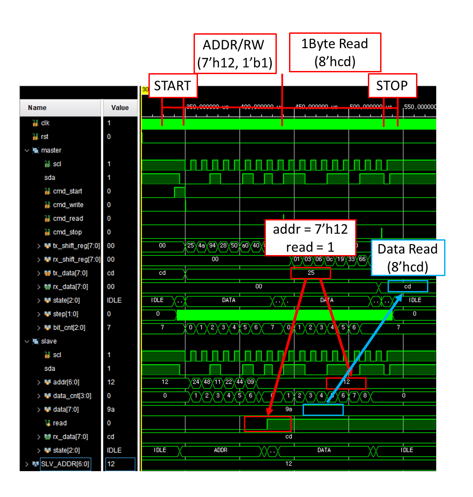

- Sequence : START → ADDRESS → READ DATA(0xCD) → STOP
- Data Read 수행
- Write Data와 Read Data 일치 확인

### UVM Verification

#### UVM Architecture

- Sequence에서 생성한 데이터를 Driver를 통해 DUT에 전달
- Monitor를 통해 DUT 동작 확인
- Scoreboard 비교 및 Coverage를 통한 기능 검증

## Verification Items

> Sequence에서 생성한 Transaction과 Monitor가 SCL/SDA 신호를 통해 생성한 Transaction을 비교하여
> I2C 프로토콜 동작을 검증하였습니다.

### Data Verification

| 검증 항목 | 검증 내용 |
|-----------|-----------|
| Address / RW | Sequence ↔ Monitor Address/RW 비교 |
| Write Data | Sequence ↔ Monitor Write Data 비교 |
| Slave RX Data | Sequence Write Data ↔ Slave RX Data 비교 |
| Read Data | 마지막 Write Data ↔ Monitor Read Data 비교 |

### ACK Verification

| 검증 항목 | 검증 내용 |
|-----------|-----------|
| Address ACK / NACK | Address 전송 후 ACK/NACK 응답 확인 |
| Data ACK | Data 전송 후 ACK 응답 확인 |

## Test Scenarios

| Scenario | Description |
|----------|-------------|
| Write | Single-byte / Multi-byte Write |
| Read | Single-byte Read |
| Write & Read | Write한 Data의 Read 동작 검증 |
| Random | Write / Read Sequence를 랜덤하게 반복 수행 |

## Functional Coverage

> Random Sequence를 수행하여 Address, Read/Write Operation, Data 및 Multi-byte Transfer Length에 대한 Functional Coverage를 수집하였습니다.

### Coverage Items

| Coverage Item | Description |
|---------------|-------------|
| Address | Valid Address (7'h12) / Invalid Address |
| RW | Read / Write Operation |
| Data | Boundary Value, Pattern, Bit Pattern 및 Data Range |
| Num Data | Multi-byte Transfer Length (1~8 Byte) |

### Data Coverage

| Category | Coverage Target |
|----------|-----------------|
| Boundary Value | 0x00, 0xFF |
| Pattern | 0x55, 0xAA |
| Bit Pattern | 0x01, 0x80 |
| Data Range | Low / Mid / High |

### Coverage Result

## Verification Result

> Random Sequence를 1000회 수행하여 Transaction 비교 및 Scoreboard 검증을 진행하였습니다.

## FPGA Test

- 목적 : 2개의 FPGA간에 I2C 통신(Write/Read) 확인

- 시나리오 : Write 8'd3 -> Write 8'd11 -> Read 8'd11 -> Write 8'd15 -> Read 8'd15

## Write 8'd11 Sequence
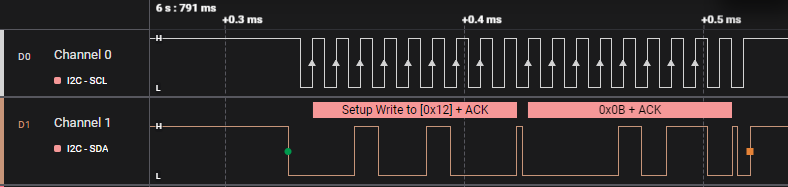

## Read 8'd11 Sequence
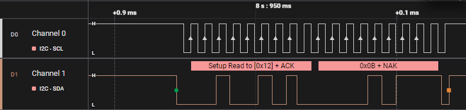

## 시나리오 동작 결과
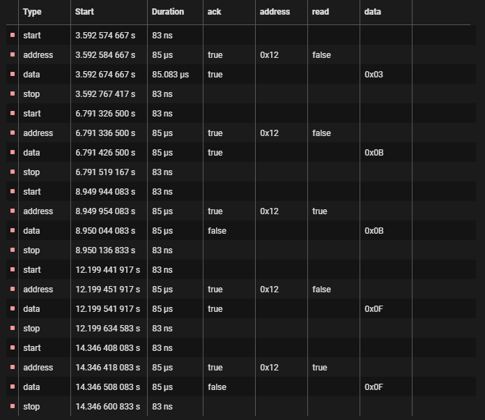

## FPGA 동작 영상
https://github.com/user-attachments/assets/4c380b88-1abd-46fa-a774-6d900383a3bc

## SPI RTL Design

### Top Architecture

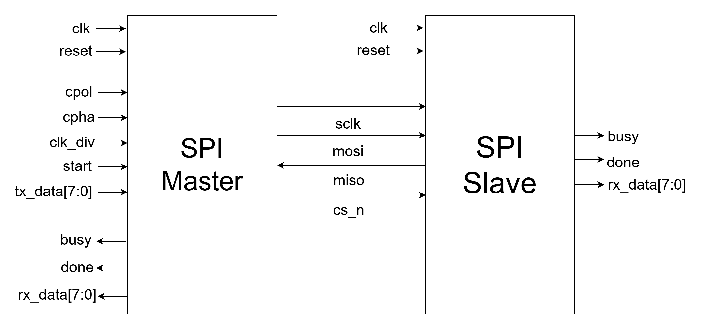

- SPI Master/Slave Top-Level 인터페이스 구성
- SCLK, MOSI, MISO 및 CS_n 기반 SPI 통신 구조
- Master에서 생성한 SCLK와 CS_n을 기준으로 Full-Duplex 데이터 송수신
- SPI Master는 CPOL/CPHA를 지원하며, SPI Slave는 Mode 0 기준으로 구현

---

### SPI Timing Diagram

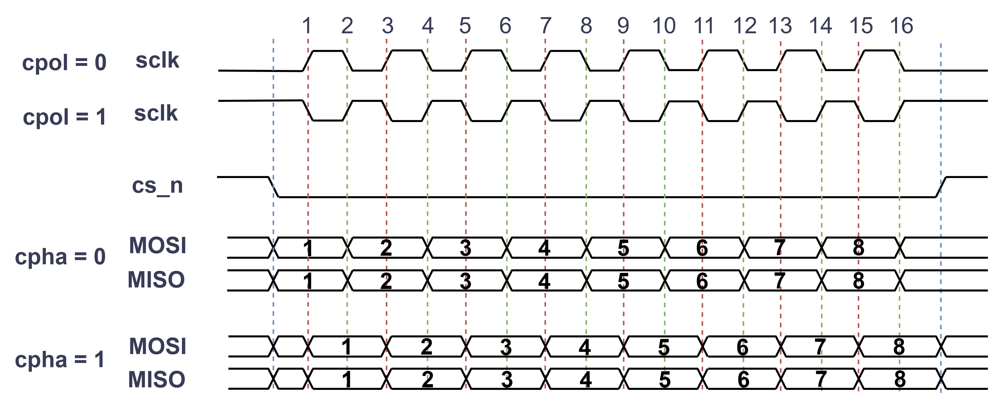

- CPOL(Clock Polarity)에 따라 SCLK의 Idle Level이 결정
- CPHA(Clock Phase)에 따라 Data Sampling 및 Output Timing이 결정
- SPI Master는 CPOL/CPHA 설정을 통해 SPI Mode 0~3을 지원하도록 설계

---

## SPI Master

#### SPI Master FSM

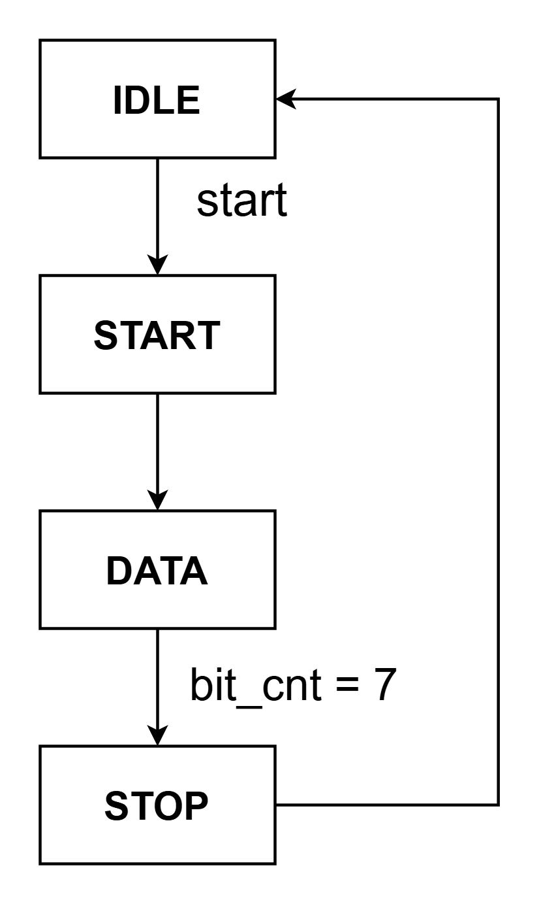

- **IDLE** : Start 신호 대기, SCLK를 CPOL값으로 Idle Level 유지
- **START** : CS_n HIGH -> LOW 변경 및 전송 시작, CPHA = 0에서 첫 번째 MOSI 데이터를 출력
- **DATA** : SCLK를 기준으로 MOSI/MISO 데이터 송수신, 8-bit 데이터 전송 수행
- **STOP** : CS_n LOW -> HIGH 변경 및 IDLE 상태로 복귀

---

#### SCLK Generation

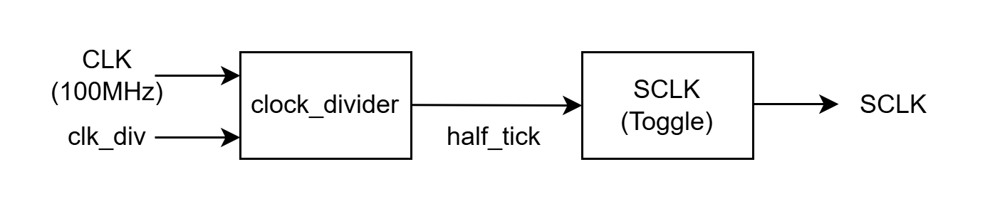

- Clock Divider를 이용하여 SCLK 생성
- clk_div 값을 통해 SPI 통신 속도 조절
- Half Tick마다 SCLK를 Toggle

### Simulation Waveform

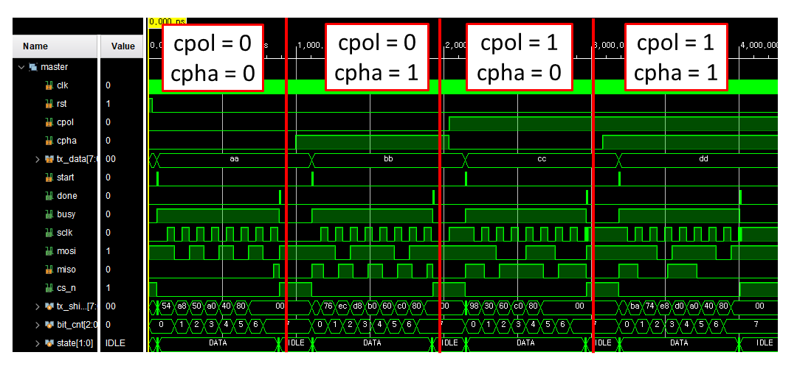

- SPI Master의 CPOL/CPHA(Mode 0~3) 동작 검증 결과

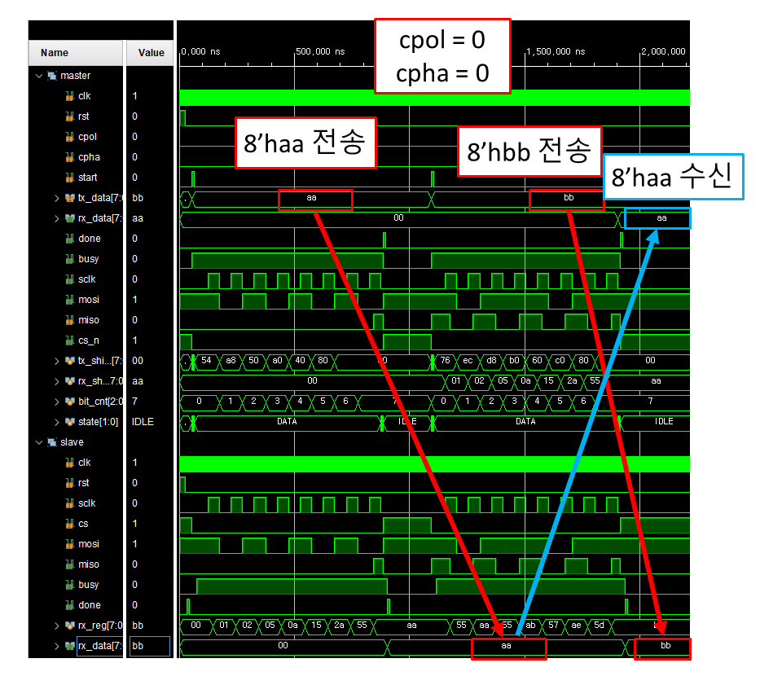

- SPI Mode 0(CPOL=0, CPHA=0)에서 Master와 Slave 간 데이터 송수신 확인

### UVM Verification

#### UVM Architecture

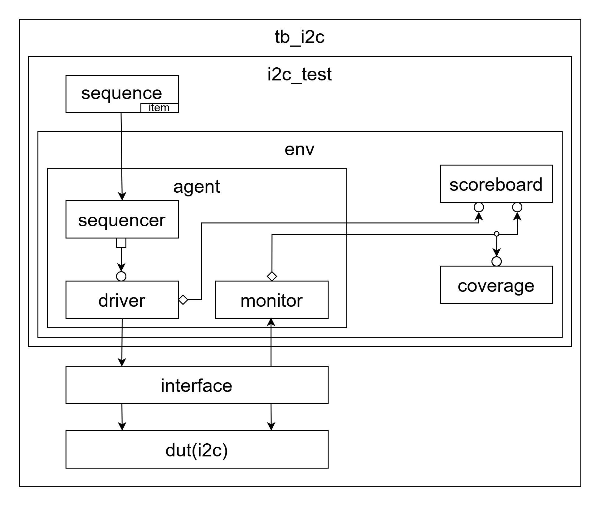

- Sequence에서 생성한 Transaction을 Driver를 통해 DUT에 전달
- Monitor에서 SPI 인터페이스(SCLK, MOSI, MISO, CS_n)기반 Transaction 생성
- Sequence의 예상 Transaction과 Monitor의 실제 Transaction을 Scoreboard에서 비교하여 SPI 동작을 검증

#### Verification Items

- Master TX → MOSI → Slave RX 데이터 전달 검증
- Slave TX → MISO → Master RX 데이터 전달 검증
- Scoreboard에서 Expected Transaction, Actual Transaction을 비교하여 데이터 일치 여부 검증

## Functional Coverage

> Covergroup을 통해 Master TX, Slave RX, Slave TX, Master RX를 대상으로
> Functional Coverage를 측정하였습니다.

### Coverage Items

| Coverage Item | Description |
|---------------|-------------|
| Master TX | Master 송신 데이터 Coverage |
| Slave RX | Slave 수신 데이터 Coverage |
| Slave TX | Slave 송신 데이터 Coverage |
| Master RX | Master 수신 데이터 Coverage |

### Data Coverage

| Category | Coverage Target |
|----------|-----------------|
| Pattern | 0x00, 0x55, 0xAA, 0xFF |
| Others | Random Data |

### Coverage Result

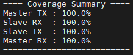

## Verification Result

> Random Sequence를 1000회 수행하여 Transaction 비교 및 Scoreboard 검증을 진행하였습니다.

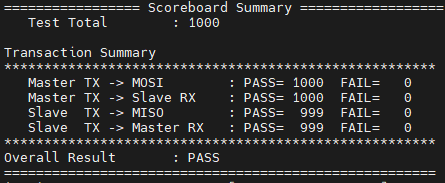

## FPGA Test

- 목적 : 2개의 FPGA간에 SPI 통신 확인

시나리오 : 이전 전송 데이터 수신 확인
- Master에서 1, 3, 6, 14, 15를 순차적으로 전송
- 첫 번째 전송에서는 Slave의 초기값(0) 수신
- 이후 전송에서는 이전에 전송된 데이터가 순차적으로 수신되는지 확인

## TX: 8'd1 / RX: 8'd0
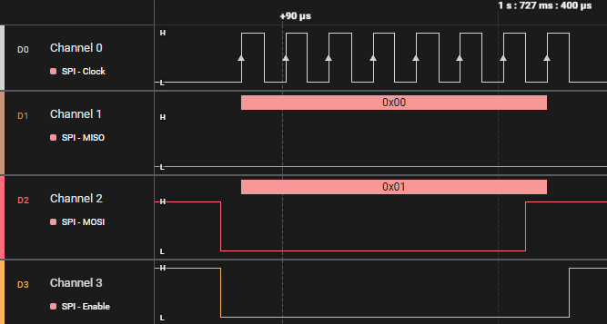

## TX: 8'd3 / RX: 8'd1
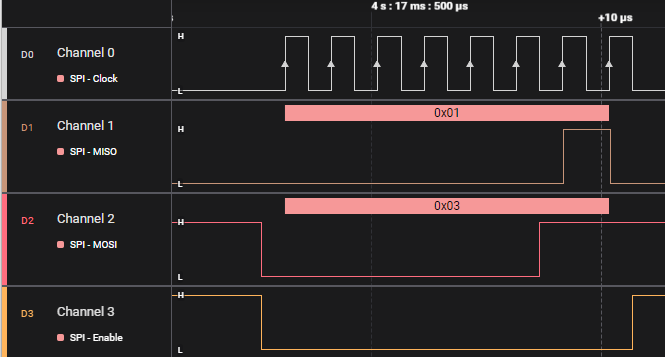

## 시나리오 동작 결과
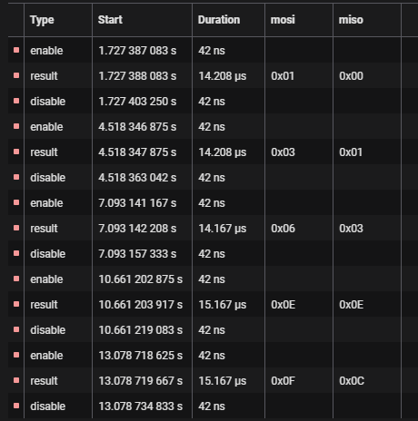

## FPGA 동작 영상
https://github.com/user-attachments/assets/cefe9681-18cb-4067-88be-2bf5de08db23

(작성 예정)

---

## What I Learned

(작성 예정)
