# I2C & SPI RTL Design

Verilog/SystemVerilog를 사용하여 I2C 및 SPI Master/Slave를 RTL로 설계하고, 
Simulation, UVM 및 FPGA 검증을 진행한 프로젝트입니다.

---

## Project Overview

| 항목 | 내용 |
|:---|:---|
| Language | Verilog, SystemVerilog |
| Development Environment | Vivado, VCS, Verdi |
| Protocol | I2C, SPI |
| Verification | Testbench, UVM, FPGA |
| Features | I2C/SPI Protocol Design and Verification |
| FPGA Board | Basys3 |
 
---
 
## Contents

- [I2C RTL Design](#i2c-rtl-design)
  - [I2C Top Architecture](#i2c-top-architecture)
  - [I2C Address and Data Frames](#i2c-address-and-data-frames)
  - [I2C Master](#i2c-master)
  - [I2C Slave](#i2c-slave)
  - [I2C Verification](#i2c-verification)
  - [I2C FPGA Test](#i2c-fpga-test)

- [SPI RTL Design](#spi-rtl-design)
  - [SPI Top Architecture](#spi-top-architecture)
  - [SPI Timing Diagram](#spi-timing-diagram)
  - [SPI Master](#spi-master)
  - [SPI Slave](#spi-slave)
  - [SPI Verification](#spi-verification)
  - [SPI FPGA Test](#spi-fpga-test)

---

## I2C RTL Design

### I2C Top Architecture

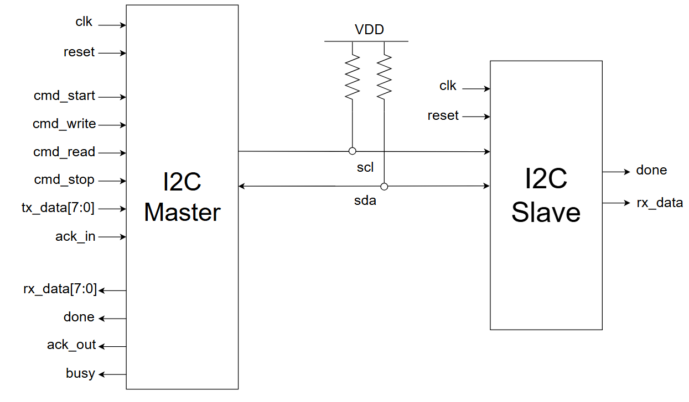

- I2C Master, Slave로 구성된 Top-Level 구조
- SCL과 SDA를 기반으로 Address 및 Data 송수신

---

### I2C Address and Data Frames

- Start Condition 이후 Address/RW Frame과 Data Frame을 순차적으로 전송
- 각 Frame 전송 후 ACK/NACK를 확인하고 Stop Condition으로 통신 종료

---

### I2C Master

#### I2C Master FSM

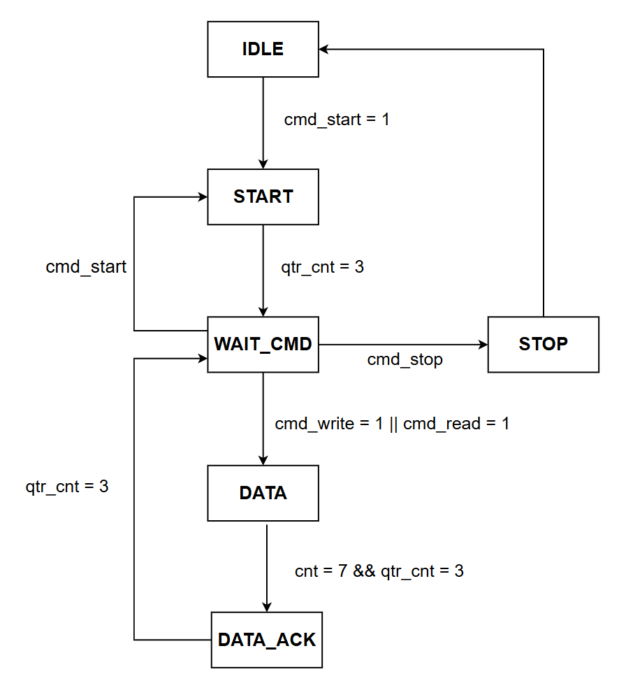

- **IDLE** : 통신 시작 명령 대기
- **START** : Start Condition 생성
- **WAIT_CMD** : Read/Write 및 Stop/Restart 명령 대기
- **DATA** : 데이터 송수신
- **DATA_ACK** : ACK/NACK 송수신
- **STOP** : Stop Condition 생성 후 IDLE 상태로 복귀

---

#### Quarter Tick and Step Counter

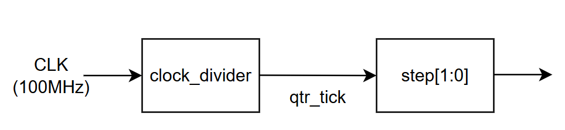

- Clock Divider를 이용하여 SCL 주기의 1/4 단위인 Quarter Tick 생성
- Step Counter를 통해 Quarter Tick 기준의 4-Step Timing 제어

---

#### Start / Stop Condition

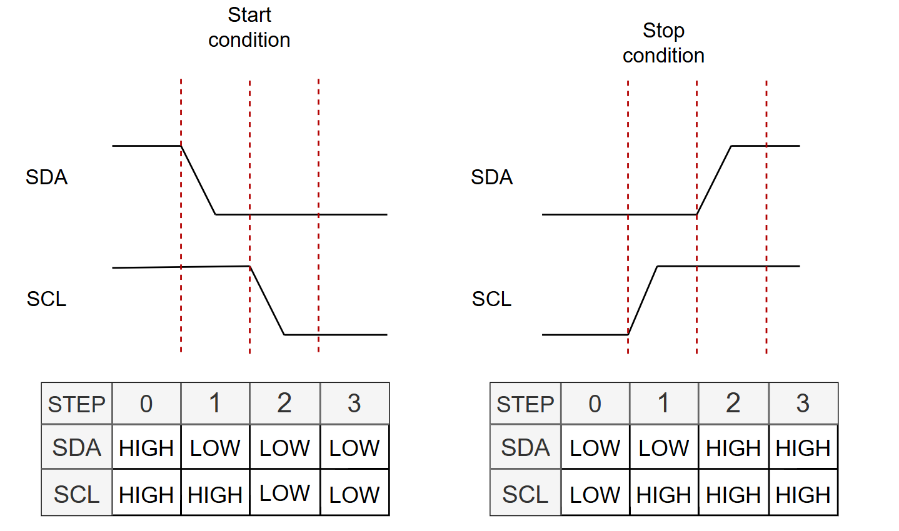

- 4-Step Timing에 따라 SCL과 SDA의 출력 시점 제어
- SCL이 High인 상태에서 SDA를 변경하여 Start/Stop Condition 생성

---

#### Data Transfer

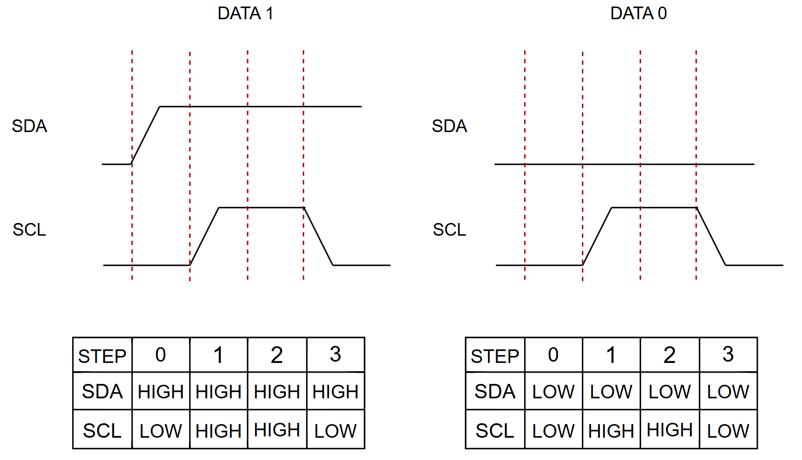

- Data Bit 값에 따라 SDA를 High 또는 Low로 출력
- 4-Step Timing에 따라 SCL을 제어하여 Data Bit 전송

##### Write Sequence

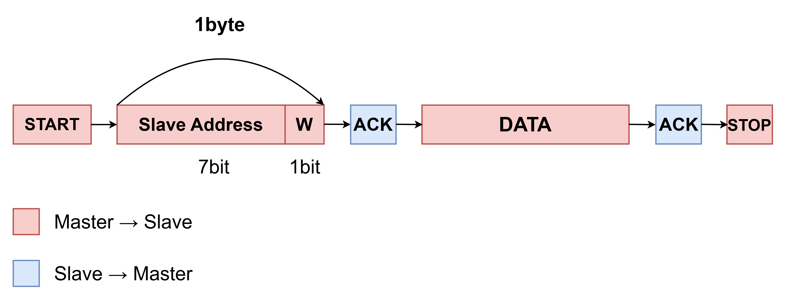

##### Read Sequence

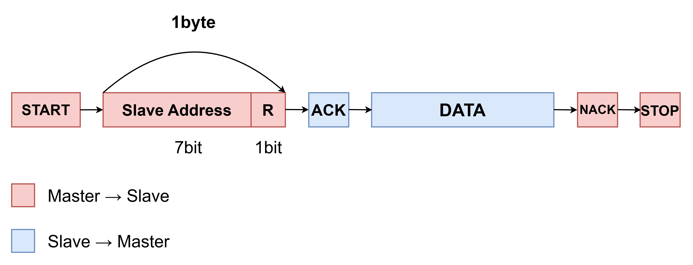

---

#### Open-Drain SDA

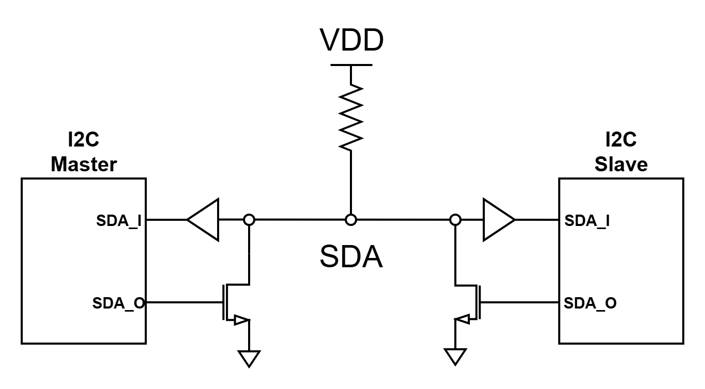

- SDA는 Open-Drain 방식으로 동작
- Low 출력 시 `SDA = 0`, High 출력 시 `SDA = High-Z`
- Pull-up 저항을 통해 SDA가 High 상태를 유지

---

### I2C Slave

#### I2C Slave FSM

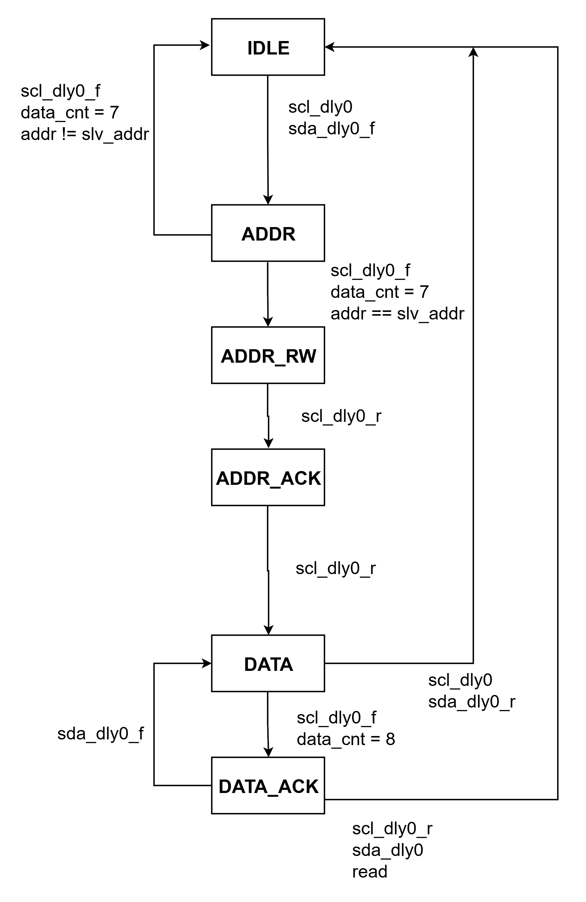

- **IDLE** : Start Condition 대기
- **ADDR** : Slave Address 수신 및 비교
- **ADDR_RW** : Read/Write 모드 결정
- **ADDR_ACK** : Slave Address가 일치하면 ACK 출력
- **DATA** : 데이터 송수신
- **DATA_ACK** : ACK/NACK에 따른 다음 동작 결정

#### SCL Edge Timing

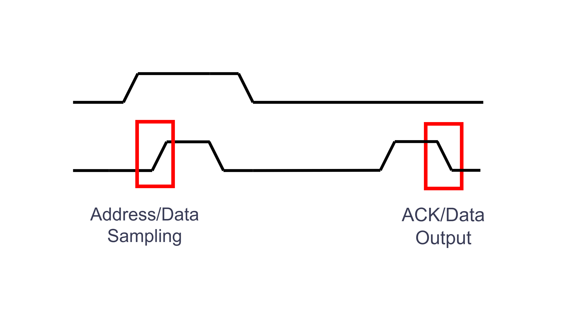

- SCL Rising Edge에서 SDA 신호 Sampling
- SCL Falling Edge에서 ACK 및 Read Data 출력

---

### I2C Verification

#### Simulation Waveform

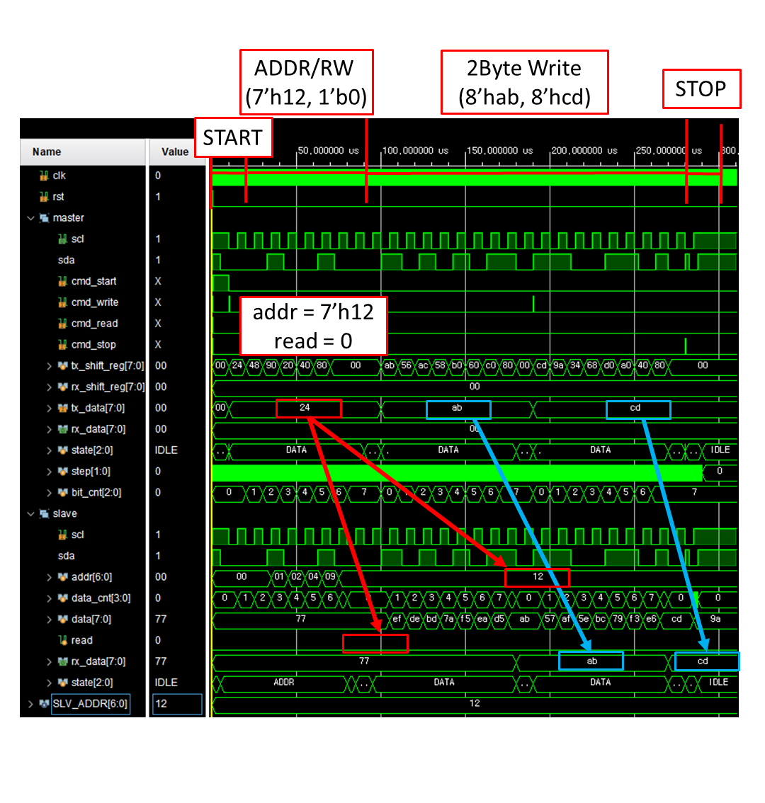

- Sequence: START → ADDRESS/RW (`0x24`) → WRITE DATA (`0xAB`) → WRITE DATA (`0xCD`) → STOP
- Multi-byte Write 수행
- Master TX Data와 Slave RX Data의 일치 여부 확인

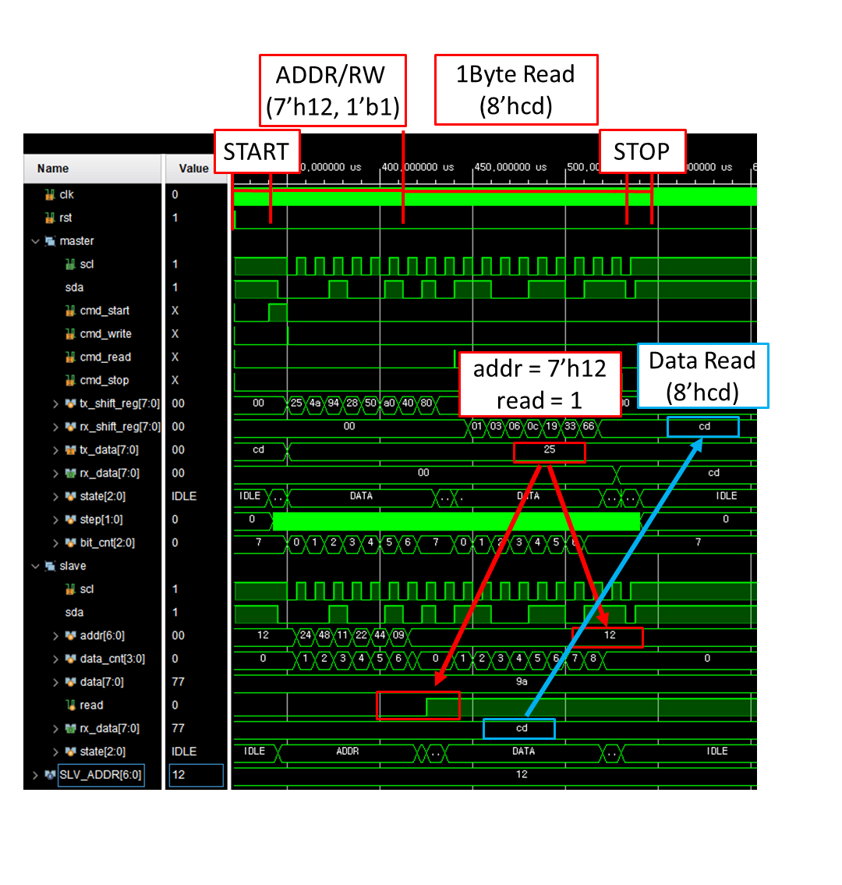

- Sequence: START → ADDRESS/RW (`0x25`) → READ DATA (`0xCD`) → STOP
- Single-byte Read 동작 수행
- Write Data와 Read Data의 일치 여부 확인

#### UVM Architecture

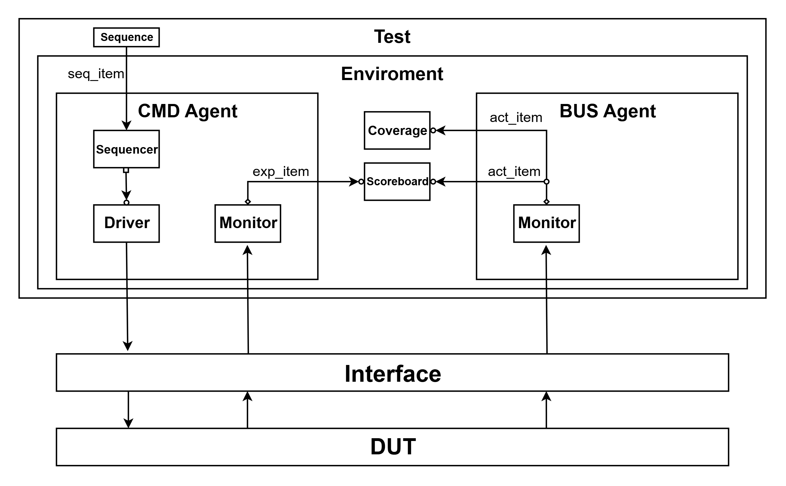

- CMD Monitor와 BUS Monitor에서 Expected/Actual Transaction 생성
- Scoreboard에서 Address/RW, ACK/NACK 및 Command/Bus/Slave Data 비교
- BUS Monitor에서 수집한 Transaction을 기반으로 Functional Coverage 측정

#### Test Scenarios

| Scenario | Description |
|:---|:---|
| Write | 1~8-byte Write 및 Command/Bus/Slave Data 비교 |
| Read | Single-byte Read 및 Bus/Master RX Data 비교 |
| Write & Read | 마지막 Write Data를 Read하여 데이터 일치 여부 확인 |
| Random | Address와 Write/Read를 Random하게 생성하여 1,000회 반복 검증 |

#### Functional Coverage

Random Sequence를 통해 주요 Address, R/W, Write Data 및 Transfer Length를 확인하였습니다.

| Coverage Item | Description |
|:---|:---|
| Address | Valid Address (`7'h12`) 및 Invalid Address |
| R/W | Write 및 Read |
| Address × R/W | Valid/Invalid Address와 Write/Read 조합 |
| Write Data | 8-bit Write Data Range |
| Write Length | 1~8-byte Transfer Length |

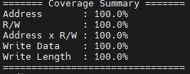

#### Verification Result

> Random Sequence 1,000회를 수행하여 Address/RW, ACK/NACK 및 Command/Bus/Slave Data의 일치 여부를 확인하였습니다.

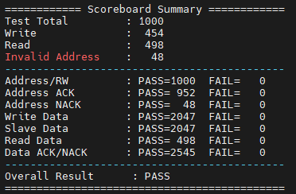

### I2C FPGA Test

#### Test Scenario

- 두 FPGA 간 I2C Write/Read 동작 검증
- Write `8'd3` → Write `8'd11` → Read `8'd11` → Write `8'd15` → Read `8'd15`

#### Write Sequence (`8'd11`)
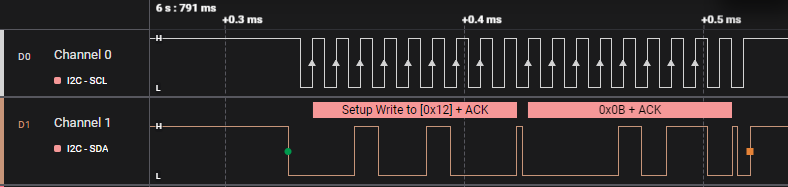

#### Read Sequence (`8'd11`)
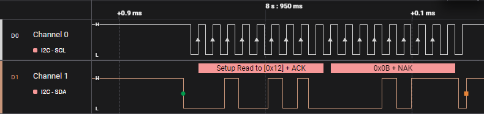

#### Logic Analyzer Result
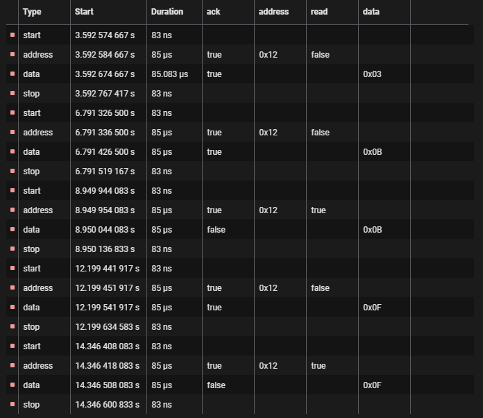

#### FPGA 동작 영상
[▶ I2C FPGA 동작 영상](https://github.com/user-attachments/assets/4c380b88-1abd-46fa-a774-6d900383a3bc)

---

## SPI RTL Design

### SPI Top Architecture

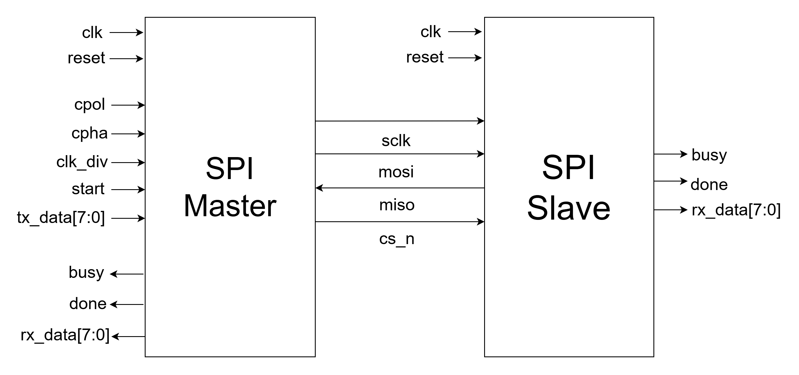

- SPI Master와 Slave로 구성된 Top-Level 구조
- Master에서 생성한 `SCLK`와 `CS_n`을 기준으로 동작
- `MOSI`와 `MISO`를 통한 Full-Duplex 데이터 송수신
- SPI Master는 Mode 0~3을 지원하며, SPI Slave는 Mode 0으로 구현

---

### SPI Timing Diagram

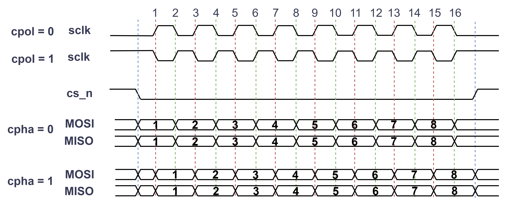

- CPOL (Clock Polarity)에 따라 `SCLK`의 Idle Level 결정
- CPHA (Clock Phase)에 따라 Data Sampling 및 Output Timing 결정
- CPOL/CPHA 설정을 통해 SPI Mode 0~3 지원

---

### SPI Master

#### SPI Master FSM

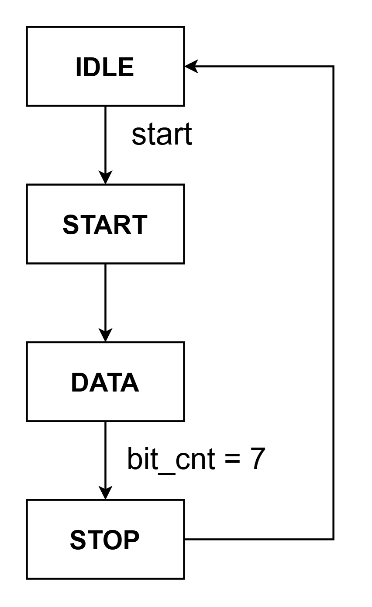

- **IDLE** : Start 신호 대기 및 `SCLK`를 CPOL 값으로 유지
- **START** : `CS_n`을 High → Low로 전환하고, CPHA가 0이면 첫 번째 `MOSI` Data 출력
- **DATA** : `SCLK` Edge에 따라 8-bit `MOSI`/`MISO` Data 송수신
- **STOP** : `CS_n`을 Low → High로 전환하고 IDLE 상태로 복귀

#### SCLK Generation

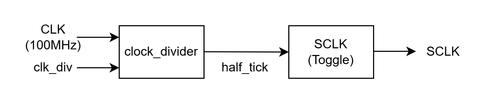

- Clock Divider를 이용하여 `SCLK` 생성
- `clk_div` 설정값을 통해 SPI 통신 속도 조절
- Half Tick마다 `SCLK`를 Toggle하여 SPI Clock 생성

---

### SPI Slave

- SPI Mode 0 기준으로 `SCLK` Rising Edge에서 `MOSI` Data Sampling
- Shift Register를 이용하여 `MISO` Data 출력
- `CS_n`이 High로 전환되면 수신 Data 저장 및 전송 완료

---

### SPI Verification

SPI Master의 Mode 0~3 동작과 Master/Slave 간 Mode 0 Full-Duplex 통신을 검증하였습니다.

#### Simulation Waveform

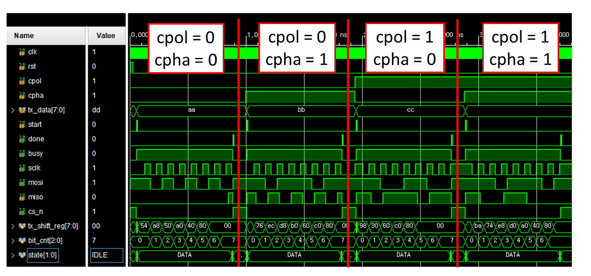

- CPOL/CPHA 설정에 따른 SPI Master의 Mode 0~3 동작 확인

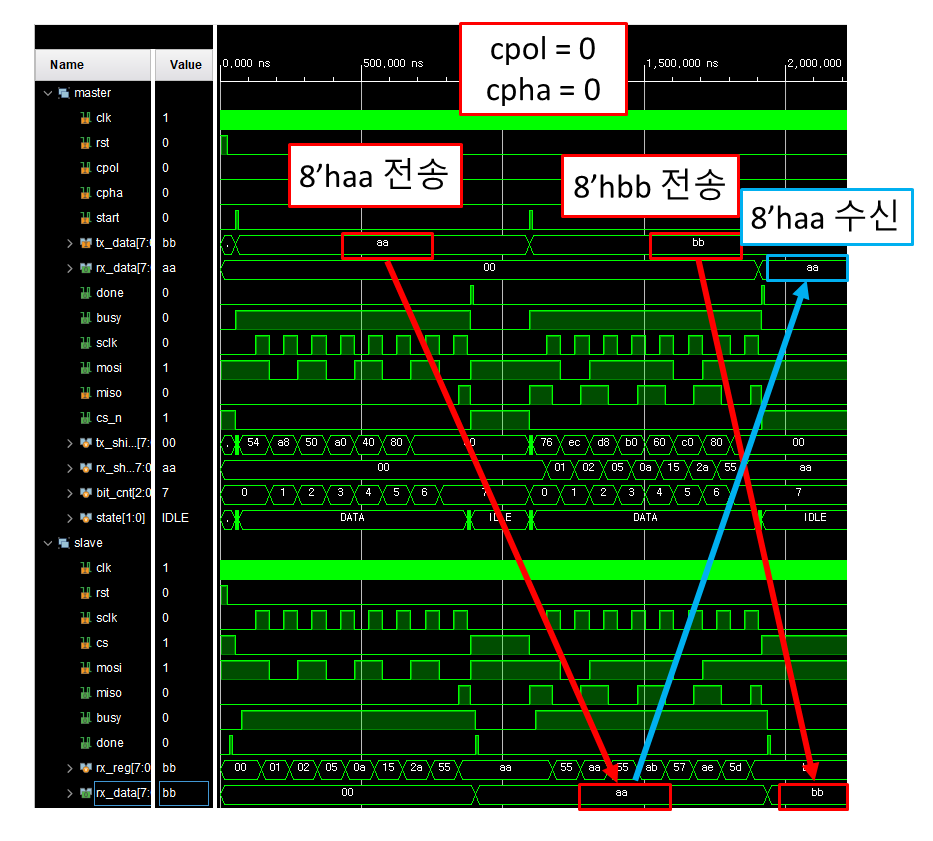

- SPI Mode 0 (CPOL=0, CPHA=0)에서 Master와 Slave 간 Full-Duplex 데이터 송수신 확인

#### UVM Architecture

##### Master/Slave Mode 0

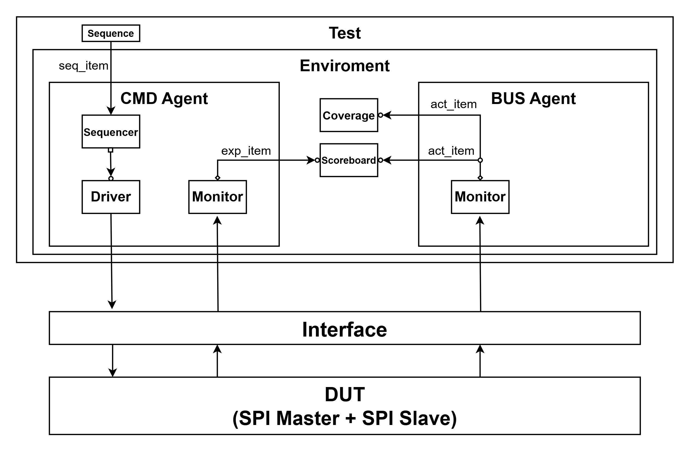

- CMD Monitor와 BUS Monitor에서 Expected/Actual Transaction 생성
- SPI Master와 RTL Slave를 연결하여 Mode 0 Full-Duplex 통신 검증
- Scoreboard에서 Master TX/Slave RX 및 Slave TX/Master RX Data 비교
- BUS Monitor에서 수집한 Transaction을 기반으로 Functional Coverage 측정

##### SPI Master Mode 0~3

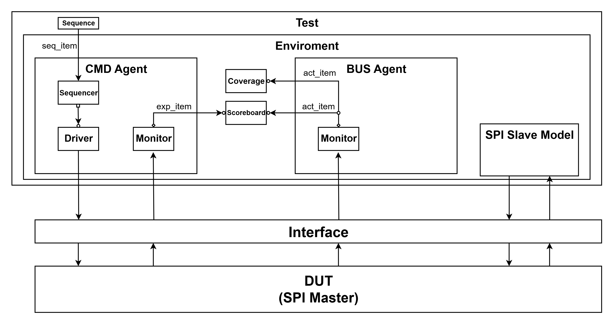

- CMD Monitor와 BUS Monitor에서 Expected/Actual Transaction 생성
- SPI Slave Model에서 CPOL/CPHA에 맞춰 `MISO` Data 출력
- Scoreboard에서 Mode, Master TX, Slave TX 및 Master RX Data 비교
- BUS Monitor에서 수집한 Transaction을 기반으로 Functional Coverage 측정

#### Test Scenarios

| Scenario | Description |
|:---|:---|
| Master/Slave Mode 0 | Master TX/Slave RX 및 Slave TX/Master RX Data 비교 |
| Master Mode 0~3 | CPOL/CPHA에 따른 Mode와 MOSI/MISO Data 비교 |
| Random | 각 UVM 환경에서 송수신 Data를 Random하게 생성하여 1,000회 반복 검증 |

#### Functional Coverage

Random Sequence를 통해 SPI Mode와 MOSI/MISO Data 범위를 확인하였습니다.

| Coverage Item | Description |
|:---|:---|
| Mode | CPOL/CPHA에 따른 SPI Mode 0~3 |
| MOSI Data | Master에서 송신한 8-bit Data |
| MISO Data | Slave에서 송신한 8-bit Data |

##### Master/Slave Mode 0

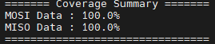

##### SPI Master Mode 0~3

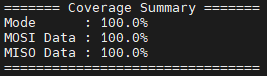

#### Verification Result

##### Master/Slave Mode 0

> Random Sequence 1,000회를 수행하여 Master TX/Slave RX 및 Slave TX/Master RX Data의 일치 여부를 확인하였습니다.

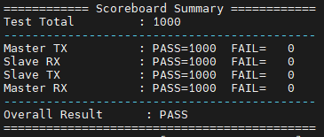

##### SPI Master Mode 0~3

> Random Sequence 1,000회를 수행하여 Mode, Master TX, Slave TX 및 Master RX Data의 일치 여부를 확인하였습니다.

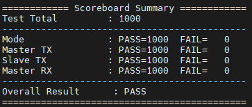

### SPI FPGA Test

#### Test Scenario

- 두 FPGA 간 SPI Full-Duplex 통신 검증
- Master에서 `8'h01 → 8'h03 → 8'h06 → 8'h0E → 8'h0F` 순서로 데이터 전송
- 첫 번째 전송에서는 Slave의 초기값 `8'h00` 수신
- 이후 전송에서는 직전 TX Data를 RX Data로 수신

#### TX: `8'd1` / RX: `8'd0`
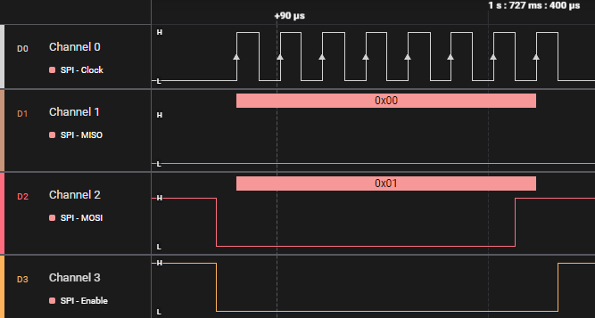

#### TX: `8'd3` / RX: `8'd1`
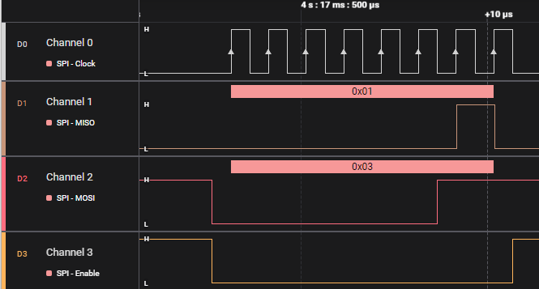

#### Logic Analyzer Result
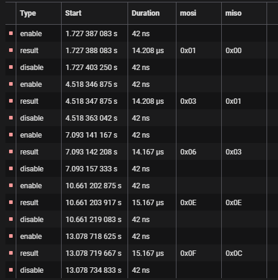

#### FPGA 동작 영상
[▶ SPI FPGA 동작 영상](https://github.com/user-attachments/assets/cefe9681-18cb-4067-88be-2bf5de08db23)
