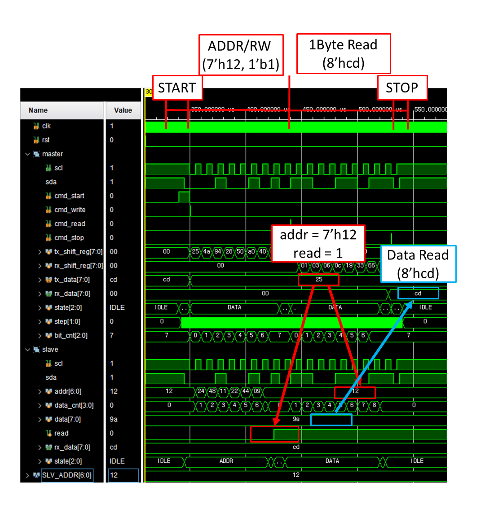
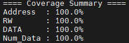
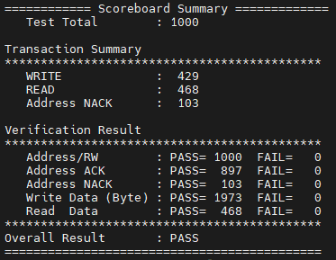
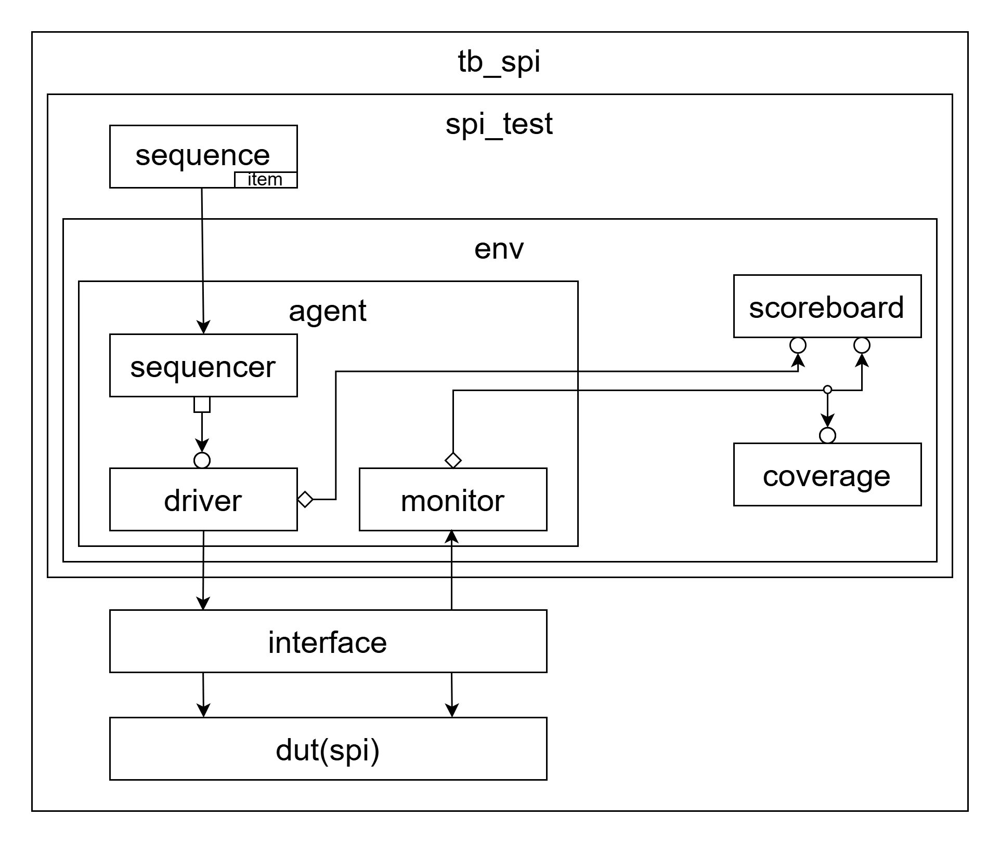
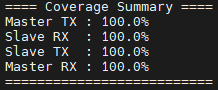
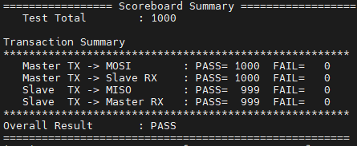

# I2C & SPI RTL Design

Verilog/SystemVerilog를 사용하여 I2C 및 SPI Master/Slave를 RTL로 설계하고,  
Simulation, UVM 및 FPGA 검증을 진행한 프로젝트입니다.

---

## Project Overview

| 항목 | 내용 |
|:---|:---|
| Language | Verilog, SystemVerilog |
| Development Environment | Vivado, VCS, Verdi |
| Protocol | I2C, SPI |
| Verification | Testbench, UVM, FPGA |
| Features | I2C/SPI Protocol Design and Verification |
| FPGA Board | Basys3 |
 
---
 
## Contents

- [I2C RTL Design](#i2c-rtl-design)
  - [I2C Top Architecture](#i2c-top-architecture)
  - [I2C Master](#i2c-master)
  - [I2C Slave](#i2c-slave)
  - [I2C Verification](#i2c-verification)
  - [I2C FPGA Test](#i2c-fpga-test)

- [SPI RTL Design](#spi-rtl-design)
  - [SPI Top Architecture](#spi-top-architecture)
  - [SPI Master](#spi-master)
  - [SPI Verification](#spi-verification)
  - [SPI FPGA Test](#spi-fpga-test)

---

## I2C RTL Design

### I2C Top Architecture

- I2C Master, Slave로 구성된 Top-Level 구조
- SCL/SDA 기반 I2C 통신

---

### I2C Address and Data Frames

- Start → Address Frame → Data Frame → Stop
- Address/RW Frame 전송 후 Data Frame 송수신

---

### I2C Master

#### I2C Master FSM

- **IDLE** : 초기 상태
- **START** : Start Condition 생성
- **WAIT_CMD** : Read/Write 및 Stop/Restart 명령 대기
- **DATA** : Read/Write 동작
- **DATA_ACK** : ACK 송수신
- **STOP** : Stop Condition 생성

---

#### Quarter Tick and Step Counter

- Clock Divider를 이용한 Quarter Tick 생성
- Step Counter를 이용한 4-Step 생성

---

#### Start / Stop Condition

- 4-Step Timing을 이용한 Start/Stop Condition 생성

---

#### Data Transfer

- Step별 SDA/SCL 출력 값 정의
- 4-Step Timing에 따른 출력 제어

##### Write Sequence

##### Read Sequence

---

#### Open-Drain SDA

- SDA는 Open-Drain 방식으로 동작
- High는 High-Z를 출력, Low는 0을 출력
- Pull-up 저항을 통해 Bus가 High 상태를 유지

---

### I2C Slave

#### I2C Slave FSM

- **IDLE** : Start Condition 대기
- **ADDR** : Slave Address 수신 및 비교
- **ADDR_RW** : Read/Write 모드 결정
- **ADDR_ACK** : Address Match 시 ACK 출력
- **DATA** : Read/Write 데이터 송수신
- **DATA_ACK** : ACK/NACK에 따른 다음 동작 결정

#### SCL Edge Timing

- Rising Edge에서 SDA 신호 Sampling
- Falling Edge에서 ACK 및 Read Data 출력

---

### I2C Verification

#### Simulation Waveform

- Sequence : START → ADDRESS/RW(0x24) → WRITE DATA(0xab) → WRITE DATA(0xcd) → STOP
- Multi-byte Data Write 수행
- Master TX Data → Slave RX Data 확인

- Sequence : START → ADDRESS/RW(0x25) → READ DATA(0xCD) → STOP
- Data Read 수행
- Write Data와 Read Data 일치 확인

#### UVM Architecture

- Sequence에서 생성한 데이터를 Driver를 통해 DUT에 전달
- Monitor에서 SCL/SDA 신호를 기반으로 Transaction 생성
- Scoreboard 비교 및 Coverage를 통한 기능 검증

#### Test Scenarios

| Scenario | Description |
|----------|-------------|
| Write | Single-byte / Multi-byte Write |
| Read | Single-byte Read |
| Write & Read | Write한 Data의 Read 동작 검증 |
| Random | Write / Read Sequence를 랜덤하게 반복 수행 |

#### Functional Coverage

Random Sequence를 수행하여 Address, Read/Write Operation, 
Data 및 Multi-byte Transfer Length에 대한 Functional Coverage를 검증하였습니다.

| Coverage Item | Description |
|---------------|-------------|
| Address | Valid Address (7'h12) / Invalid Address |
| RW | Read / Write Operation |
| Data | Boundary Value, Pattern, Bit Pattern 및 Data Range |
| Num Data | Multi-byte Transfer Length (1~8 Byte) |

#### Verification Result

> Random Sequence 1000회를 수행하여 Scoreboard 기반 Transaction 검증을 진행하였습니다.

### I2C FPGA Test

- 목적 : 두 FPGA 간 I2C Write/Read 동작 검증

- 시나리오 :
  Write 8'd3 → Write 8'd11 → Read 8'd11 → Write 8'd15 → Read 8'd15

#### Write Sequence (8'd11)

#### Read Sequence (8'd11)

#### Logic Analyzer Result

#### FPGA 동작 영상
https://github.com/user-attachments/assets/4c380b88-1abd-46fa-a774-6d900383a3bc

## SPI RTL Design

### SPI Top Architecture

- SPI Master/Slave Top-Level 인터페이스 구성
- SCLK, MOSI, MISO 및 CS_n 기반 SPI 통신 구조
- Master에서 생성한 SCLK와 CS_n을 기준으로 Full-Duplex 데이터 송수신
- SPI Master는 CPOL/CPHA를 지원하며, SPI Slave는 Mode 0 기준으로 구현

---

### SPI Timing Diagram

- CPOL(Clock Polarity)에 따라 SCLK의 Idle Level이 결정
- CPHA(Clock Phase)에 따라 Data Sampling 및 Output Timing이 결정
- SPI Master는 CPOL/CPHA 설정을 통해 SPI Mode 0~3을 지원하도록 설계

---

### SPI Master

#### SPI Master FSM

- **IDLE** : Start 신호 대기, SCLK를 CPOL값으로 Idle Level 유지
- **START** : CS_n HIGH -> LOW 변경 및 전송 시작, CPHA = 0에서 첫 번째 MOSI 데이터를 출력
- **DATA** : SCLK를 기준으로 MOSI/MISO 데이터 송수신, 8-bit 데이터 전송 수행
- **STOP** : CS_n LOW -> HIGH 변경 및 IDLE 상태로 복귀

#### SCLK Generation

- Clock Divider를 이용하여 SCLK 생성
- clk_div 값을 통해 SPI 통신 속도 조절
- Half Tick마다 SCLK를 Toggle

---

### SPI Verification

- SPI Master는 Mode 0~3을 지원하도록 설계하였으며, 
  SPI Slave는 Mode 0 기준으로 구현하여 Mode 0 동작을 검증 진행하였습니다.

#### Simulation Waveform

- SPI Master의 CPOL/CPHA(Mode 0~3) 동작 검증 결과

- SPI Mode 0(CPOL=0, CPHA=0)에서 Master와 Slave 간 데이터 송수신 확인

#### UVM Architecture

- Sequence에서 생성한 Transaction을 Driver를 통해 DUT에 전달
- Monitor에서 SPI 인터페이스(SCLK, MOSI, MISO, CS_n) 기반 Transaction 생성
- Sequence의 예상 Transaction과 Monitor의 실제 Transaction을 Scoreboard에서 비교하여 검증

#### Test Scenarios

- Master TX → MOSI → Slave RX 데이터 전달 검증
- Slave TX → MISO → Master RX 데이터 전달 검증

#### Functional Coverage

> Covergroup을 통해 Master TX, Slave RX, Slave TX, Master RX를 대상으로  
> Functional Coverage를 측정하였습니다.

#### Coverage Items

| Coverage Item | Description |
|---------------|-------------|
| Master TX | Master 송신 데이터 Coverage |
| Slave RX | Slave 수신 데이터 Coverage |
| Slave TX | Slave 송신 데이터 Coverage |
| Master RX | Master 수신 데이터 Coverage |

#### Functional Coverage Result

#### Verification Result

> Random Sequence 1000회를 수행하여 Scoreboard 기반 Transaction 검증을 진행하였습니다.

### SPI FPGA Test

- 목적 : 두 FPGA 간 SPI 통신 동작 확인

#### Test Scenario
- Master에서 1, 3, 6, 14, 15를 순차적으로 전송
- 첫 번째 전송에서는 Slave의 초기값(0) 수신
- 이후 전송에서는 이전에 전송된 데이터가 순차적으로 수신되는지 확인

#### TX: 8'd1 / RX: 8'd0

#### TX: 8'd3 / RX: 8'd1

#### Logic Analyzer Result

#### FPGA 동작 영상
https://github.com/user-attachments/assets/cefe9681-18cb-4067-88be-2bf5de08db23

